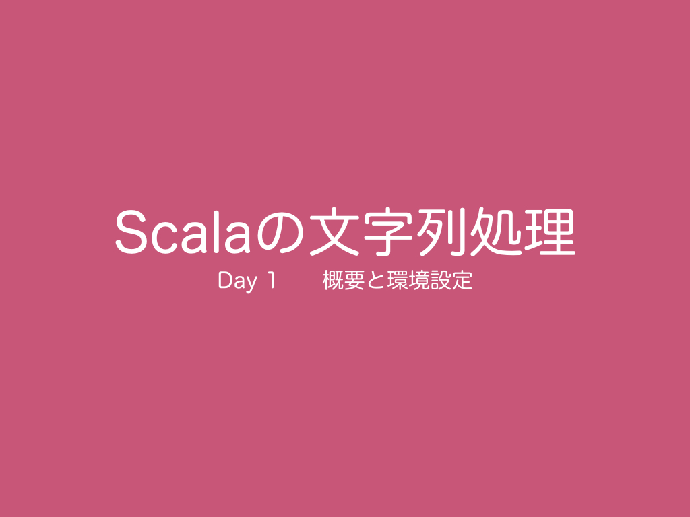

<h1>Scalaの文字列処理 - Day 1 概要と環境設定 -</h1>
  
初日は、「Scalaの文字列処理」でどのような内容に触れるのかの概要とプログラミングの環境設定について説明します。  
<h2><a href="http://ynupc.github.io/course/scalastringcourse/index.html" target="_blank">学習方法</a></h2>
<h2><a href="SUMMARY.md">目次（読み物）</a></h2>
<h2>動画</h2>
<h2><a href="//www.slideshare.net/ynupc/scala-day1" target="_blank">スライド</a></h2>
<h2><a href="https://github.com/ynupc/scalastringcourseday1" target="_blank">リポジトリ（サンプルコード）</a></h2>
<h2>クイズ</h2>
なし
<h2>アンケート</h2>
