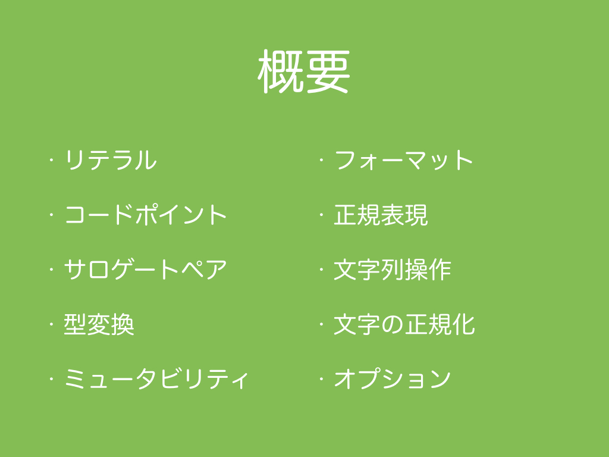

# 1.　概要

言語処理技術を開発する前に文字列処理技術を詳細に勉強することが望ましいです。 文字列処理は簡単なようで落とし穴がたくさんあります。 文字列処理技術の勉強が足りないと、文字化けや原因がよくわからないExceptionが発生したりします。 また、車輪の再発明をしてしまい、開発に余計に時間がかかったりバグが発生するリスクを高めてしまったりすることも考えられます。 さらに、処理に無駄に時間がかかったり、メモリを無駄に多く使用したりするプログラムを書いてしまうかもしれません。 文字列処理を始めることは簡単ですが、正しく・楽に・効率的な処理を書くためには実はとても深い知識が必要とされます。 そこで、そのような落とし穴に落ちてしまわないために必要な深い知識を網羅的に学べるような教材作りを目指しています。 さらに、一般的な言語処理技術は、文字列を字句解析（形態素解析）にかけますが、その字句解析にかける前の処理（文字の正規化、特殊文字のエスケープ、表記揺れや誤字脱字に対する語の正規化、顔文字の取り扱い、文分割、文の正規化、引用符による文の構造解析など）も大切です。 しかし、泥臭いだけの単純作業になるため一般に研究として扱われておらず、その重要性が見落とされがちです。 前処理の重要性を示すもののひとつとして、　<a href="https://sites.google.com/site/nlp2016ws/program" target="_blank">NLP2016ワークショップ「論文に書かない（書けない）自然言語処理」</a>で、須藤克仁さんが「論文に書けなかった特許翻訳データの前処理」という題名で特許機械翻訳のタスクでの前処理の問題と丁寧に前処理をすると精度が上がったという発表をされていました。 特許文書のように比較的丁寧に記述されている文書であっても前処理が重要であると報告されました。 前処理を丁寧に書くためにも文字列処理技術を詳細に勉強する必要があります。 言語処理技術の開発を始める前に、開発中にエラー・バグが起こらないように、起こったときにうまく対処できるように、楽に効率的な処理が書けるように、そして字句解析前の前処理が丁寧に書けるようになるために、本教材を通して文字列処理のスペシャリストを目指しましょう。

さて、本コースでは、言語処理技術をScalaで開発するための事前知識としての文字列処理についてDay 1（概要と環境設定の本回）からDay 7までの７回に分けて学習します。全ての回で一般的な文字列処理について学べますが、例示やサンプルコードに関しては日本語の文字列処理を中心に紹介します。特にDay6とDay7では、日本語の文字列処理のための著者が作成したプログラムも提供します。それでは、学習する内容についてざっと紹介します。（いずれライブラリ化して提供できるかもしれません。）

まずは、リテラルについて紹介します。 Scalaには文字や文字列に関するリテラルがたくさんあります。 文字リテラル、文字列リテラル、生文字リテラルなどです。 エスケープシーケンスやUnicodeシーケンスなどについても触れます。（Day 2）

次に、コードポイントやサロゲートペアについて紹介します。 Scalaで適切に文字を扱うためには、１文字に対してChar型１つでは不十分な場合があります。 適切に文字を扱うためにはコードポイントやサロゲートペアについて学び、Stringとコードポイント配列への相互変換方法やStringのコードポイント数を取得する方法などについて紹介します。（Day 3）

型変換では、Boolean、Int、FloatといったJavaでいうプリミティブ型にあたるScalaの型とStringとの相互変換方法について紹介します。（Day 4）

ミュータビリティでは、イミュータブルクラスであるStringを扱うミュータブルクラス、StringBuilder、StringBufferなどについて紹介します。（Day 5）

フォーマットでは、文字列のフォーマットやテンプレートに値を埋める処理について紹介します。ScalaだけではなくC言語など他の言語で`printf`という関数・メソッドが存在しますが、もし`printf`を使ったことがある方は、第一引数に"%s"や"%d"、"%f"といった記号を含めた文字列を渡しておき、第二引数以降に対応する値や変数を渡す機構に馴染みがあるかもしれません。この機構のことをprintfスタイルのフォーマットと呼び、`printf`の"f"はフォーマットを意味します。

正規表現は、文字列が特定のパターンにマッチしたかどうかを調べたり、マッチした場合、その文字列を別の文字列に削除する、置き換える、あるいは取り出すといった処理が簡単かつ柔軟に書くことができます。正規表現の使い方について紹介します。（Day 6）

文字列操作では、Stringクラスのメソッドやフォーマット、正規表現など文字列を操作する方法を処理の目的別にどのようなときにどの方法を使用するのかまとめます。(Day 6)

文字の正規化ですが、日本語のテキストを処理する際、例えばカタカナの半角の「ｶ」と全角の「カ」、あるいは「ガ」と「カ」＋濁点「゛」のように一般的に同じ文字を指すがプログラム上では一致しない文字が存在します。このような字種による揺れが存在すると、文字列の一致を見たいときに問題が発生します。文字列の一致を見る前に、前処理として一方の表記に揃えておくことで不一致の問題を防ぐことができます。これを文字の正規化と呼び、具体的な方法について紹介します。（Day 7）

最後にオプションというScalaにある<a href="http://docs.oracle.com/javase/jp/8/api/java/lang/NullPointerException.html" target="_blank">NullPointerException</a>を排除するために役に立つ機構について紹介します。（Day 7）

***
<h2>なぜScalaか</h2>

自然言語処理に用いられるプログラミング言語の流行の歴史を抑えた上で、最近流行しているPythonとの比較を述べます。

<h3>自然言語処理に用いられるプログラミング言語の流行</h3>

著者の実感では、自然言語処理に用いられるプログラミング言語は、Shell, C, Prolog, Perl, Java, Pythonの順番に流行していると感じています。
Scalaは著者のように自然言語処理で使用している人もいますが、まだ流行していると言えるほどの状態ではありません。
機械学習や自然言語処理を扱う<a href="http://www.scalanlp.org/" target="_blank">ScalaNLP</a>や<a href="http://factorie.cs.umass.edu/" target="_blank">FACTORIE</a>というライブラリはScalaで書かれています。
岡山大学の竹内研究室の「述語シソーラス(動詞，形容詞，形容動詞)に基づく意味役割と述語の概念フレームを自動で付与するシステム<a href="http://www.cl.cs.okayama-u.ac.jp/study/project/asa/asa-scala/" target="_blank">ASA Scala
</a>」はScalaで書かれていますし、横浜国立大学の森研究室の「世界史の論述問題を解く質問応答システム<a href="https://github.com/ktr-skmt/FelisCatusZero-multilingual/" target="_blank">FelisCatus Zero</a>」もScalaで書かれています。東北大学の乾研究室では自然言語処理のための<a href="http://www.cl.ecei.tohoku.ac.jp/index.php?Learning%20Scala" target="_blank">Scala勉強会</a>を行なっています。他にも次のような取り組みもあるため、Scalaが自然言語処理に全く使われていないという状況でもないというのが現状です。
<ul>
<li><a href="https://www.youtube.com/watch?v=3qounjyop94" target="_blank">Scalaによる自然言語処理 - #DSIRNLP 4</a> (2013年)</li>
<li><a href="https://github.com/Yuichiroh/nlp100" target="_blank">言語処理100本ノック 2015 in Scala</a> (2015年)</li>
<li><a href="http://qiita.com/q-ikawa/items/cf1bb593185333d88d66" target="_blank">Scalaで自然言語処理：組み合わせ範疇文法(Combinatory Categorial Grammar: CCG) パーサを作りかけてみた</a>　(2017年)</li>
</ul>

首都大学東京の小町先生の武蔵野日記の「<a href="http://d.hatena.ne.jp/mamoruk/20090327/p1" target="_blank">自然言語処理は Python がいちばん</a>」（扇情的なタイトルに意識的にしているような？）にも最後にScalaに関する追記があり、次のように考察されている。

> 基本的に状況は変わっていないが、Scala や Clojure などの Java VM 系の言語で書かれた自然言語処理ライブラリ・ツールが増えてきた、というのが4年前と比べて変わってきたところだろうか。(個人的には、これらの言語がスタンダードになることについては懐疑的であるが、研究で使うには便利である。)

以上のように、少しずつ自然言語処理にScalaが浸透してきているといったところです。

<h4>Shell（1970-90年代）</h4>

自然言語処理の初期はShellコマンドを繋げてパイプラインをShellスクリプトとして作るようなプログラムでした。
例えば、テキストファイルの日本語文字コードをiconvやnkfで変換をして、
テキストファイルをcatやheadやtailで開いて、
sed, sort, uniqなどで前処理をし、
wcやgrepでカウントするといったようなパイプラインをShellスクリプトで書いていました。  

Shellコマンドの歴史は次です。
1971年に正規表現が使用できるテキストエディタedが生まれます。
1974年に正規表現が使用できるラインエディタgrepとストリームエディタsedが生まれます。
1976年にテキストエディタEmacsが生まれます。
1979年に拡張正規表現が扱えるラインエディタegrepが生まれます。
1984年に文字コード変換iconvが生まれます。
1987年に日本語文字コード変換nkf(Network Kanji Filter)が生まれます。

<h4>C（1970-90年代）</h4>

1972年にC言語が生まれます。
charが8bitであり、日本語漢字を扱うためには空間が狭いため、２つのcharを連結して１つの漢字を扱います。
C言語で特定処理に特化したコマンドラインプログラムを作成し、
Shellスクイプトで書かれたパイプラインに組み込む形で使用していました。

<h4>Prolog（1970-90年代）</h4>

1972年に述語論理でプログラムするPrologが生まれます。
1973年に自然言語を述語論理で記述する挑戦としてモンタギュー文法(Richard Montague - The Proper Treatment of Quantification in Ordinary English)が生まれ、自然言語をPrologで記述できないかといったところからPrologが流行します。
1982年に通商産業省（現経済産業省）が立ち上げたプロジェクト「第五世代コンピュータ」により日本でPrologを用いた研究が盛んになります。
自然言語を述語論理で記述するというモンタギュー文法の試みは今のところうまくいっておらず、
「第五世代コンピュータ」も1992年に終了したため、
その後は、ほとんど使われていません。

<h4>Perl（1990-2000年代）</h4>

1987年に正規表現が書けるインタプリタ言語のPerlが生まれます。
Perlで今まで通りにコマンドラインプログラムを作成し、Shellスクリプトに加えることもできますが、
iconvやnkfといった文字コード変換以外のShellコマンドはPerl上で簡単に実装でき、
さらに、Perlのsystem関数を使うことで、PerlからShellコマンドを外部プロセスとして呼び出せるため、
ShellスクリプトがPerlスクリプトに代替されました。
C言語はコンパイラ言語なので実行前にコンパイルという手間が必要ですが、Perlはインタプリタ言語のためコンパイルという手間が不要です。
さらに、C言語ではコンパイル時にコンパイルエラーが発生し、エラーを直さなければ動かせないため、結果が見られるまでに時間がかかりますが、
Perlはとりあえずの結果がすぐに返ってくる点も好感されていたかもしれません。

<h4>Java（2000-?年代）</h4>

1995年にオブジェクト指向のコンパイル言語Javaが生まれます。
Javaはオブジェクト指向プログラミングにより大規模なプログラムの設計がしやすく、
大規模なプログラムでもJVMにより処理が高速であり、
UnixとWindowsといったOSの違いもJVMがほぼ吸収するという思想が好評を博し、
様々な分野のプログラミングで人気が出ます。

Javaは、上記に加え、世界統一文字コードのUnicodeを標準に取り入れたことで、
言語処理のプログラミングにも人気が出ます。
CやPerlでは扱いづらかった文字コードがJavaではUnicodeにより比較的扱いやすくなりました。
ただし、UnicodeをUTF-16というエンコードで採用したために、サロゲートペアという問題を産むことになります。

<h4>Python（2010-?年代）</h4>

1991年にPythonが生まれます。

<h4>Scala（？）</h4>

2003年にScalaが生まれます。

<h3>Scala vs Python</h3>
<h4>型チェック</h4>
<h4>実行速度</h4>
<h4>スケーラビリティ</h4>
<h4>ドキュメントの豊富さ</h4>
<h4>ライブラリ</h4>
<h4>利用者数</h4>
