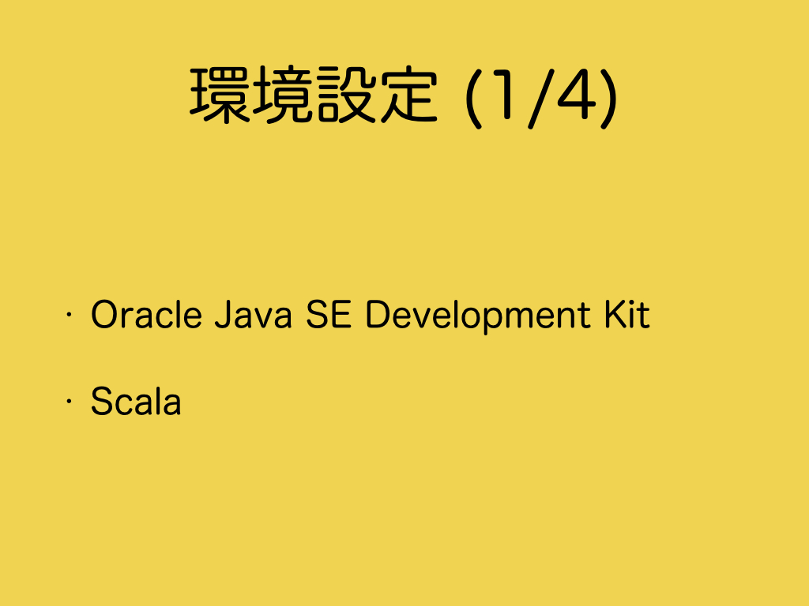
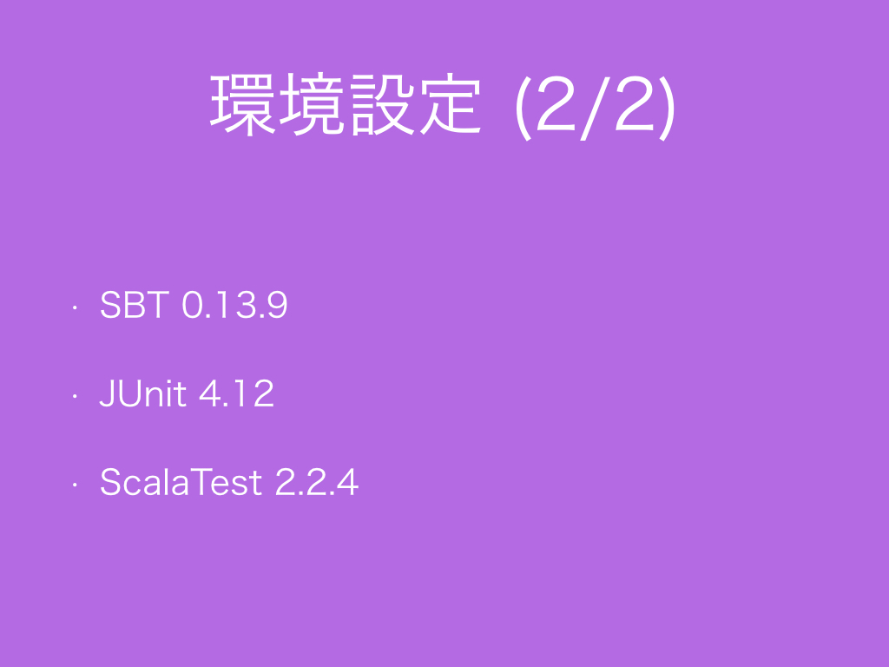

# 2.　環境設定
<h3>2.1　Java, Scala and Scala XML</h3>

開発環境としてOracle Java 8とScala 2.11を使用します。Scala Xml 1.0.5も使用します。Googleの<a href="https://github.com/google/guava" target="_blank">Guava</a>やApache <a href="https://commons.apache.org/proper/commons-lang/" target="_blank">Commons Lang</a>の<a href="https://commons.apache.org/proper/commons-lang/javadocs/api-release/org/apache/commons/lang3/StringUtils.html" target="_blank">StringUtils</a>には文字列処理に便利なメソッドが存在しますが、ここでは紹介しません。<br>
<br>
JavaやScalaなどのAPIについては、<a href="#コラムAPI">コラム：API</a>を参照ください。JavaやScalaなどの命名規則など書き方のStyleについては<a href="#コラムStyle">コラム：Style</a>を参照ください。
<h3>2.2　SBT, JUnit and ScalaTest</h3>

<br>
外部ライブラリの依存関係管理のために<a href="http://www.scala-sbt.org/index.html" target="_blank">SBT 0.13.9</a>を使用します。サンプルコードは出力結果が確認しやすいように基本的にすべてテストコードの形式で提供します。テストコードを書くために外部ライブラリとして<a href="http://junit.org/" target="_blank">JUnit 4.12</a>と<a href="http://www.scalatest.org/" taget="_blank">ScalaTest 2.2.4</a>を使用します。
<br>
IDEについては<a href="#コラムIDE">コラム：IDE</a>を参照ください。サンプルコードの文字コードについては<a href="#コラムサンプルコードの文字コード">コラム：サンプルコードの文字コード</a>を参照ください。
<h3>コラム：API</h3>
Oracle Java 8とScala 2.11とScala Xml 1.0.5のAPIのドキュメントは次です。
<ol>
<li>Java(tm) Platform, Standard Edition 8のAPI仕様<br><a href="http://docs.oracle.com/javase/jp/8/api/" target="_blank">http://docs.oracle.com/javase/jp/8/api/</a>
<li>Scala Standard Library 2.11.7 API<br><a href="http://www.scala-lang.org/api/2.11.7/" target="_blank">http://www.scala-lang.org/api/2.11.7/</a>
<li>Scala module XML API<br><a href="http://www.scala-lang.org/api/2.11.7/scala-xml/" target="_blank">http://www.scala-lang.org/api/2.11.7/scala-xml/</a>
<!--<li><a href="" target="_blank"></a>-->
</ol>
<h3>コラム：Style</h3>
言語によって慣習的に使われるコードの書き方の規約のことを、C言語ではCoding standard、JavaではCode Conventions、ScalaではStyleと言います。自分にも他人にも読みやすいプログラムを書くために一読しておくといいと思います。C/C++とJava/Scalaの<a href="https://ja.wikipedia.org/wiki/%E5%91%BD%E5%90%8D%E8%A6%8F%E5%89%87_(%E3%83%97%E3%83%AD%E3%82%B0%E3%83%A9%E3%83%9F%E3%83%B3%E3%82%B0)" target="_blank">命名規則</a>を比べてみると<a href="https://ja.wikipedia.org/wiki/%E3%82%AD%E3%83%A3%E3%83%A1%E3%83%AB%E3%82%B1%E3%83%BC%E3%82%B9" target="_blank">スネークケースなのかキャメルケースなのか</a>といった宗教色の違いが見えてくるはずです。
<ol>
<li>C Coding Standard<br><a href="https://users.ece.cmu.edu/~eno/coding/CCodingStandard.html" target="_blank">https://users.ece.cmu.edu/~eno/coding/CCodingStandard.html</a>
<li>C++ Coding Standard<br><a href="http://www.possibility.com/Cpp/CppCodingStandard.html" target="_blank">http://www.possibility.com/Cpp/CppCodingStandard.html</a>
<li>Code Conventions for the Java Programming Language<br><a href="http://www.oracle.com/technetwork/java/index-135089.html" target="_blank">http://www.oracle.com/technetwork/java/index-135089.html</a></li>
<li>Scala Style Guide<br><a href="http://docs.scala-lang.org/style/" target="_blank">http://docs.scala-lang.org/style/</a>
</ol>
<h3>コラム：IDE</h3>
サンプルコードを作成するために、IDEとして<a href="https://www.jetbrains.com/idea/" target="_blank">IntelliJ IDEA</a>とIntelliJ IDEAのプラグインとしてScalaとSBTと.gitignoreのプラグインを使用しています。
<h3>コラム：サンプルコードの文字コード</h3>
サンプルコードのファイルの文字コードはUTF-8ですので、システムプロパティの`System.getProperty("file.encoding")`がUTF-8になるように設定する必要があります。JVM始動時に指定する必要があるため`System.setProperty("file.encoding", "UTF-8")`では設定できませんので、JVMオプションで`-Dfile.encoding=UTF-8`を渡すことになります。
SBTを利用する場合は、
build.sbtファイルに```scalacOptions ++= Seq("-encoding", "UTF-8")```や```javacOptions ++= Seq("-encoding", "UTF-8")```を書くことでScalaやJavaのソースコードの文字コードをUTF-8に設定することができます。サンプルコードではbuild.sbtファイルからソースコードの文字コードを設定しています。
SBTの設定ファイル~/.sbtconfigに```SBT_OPTS=-Dfile.encoding=UTF-8```と設定しておくこともできます。

