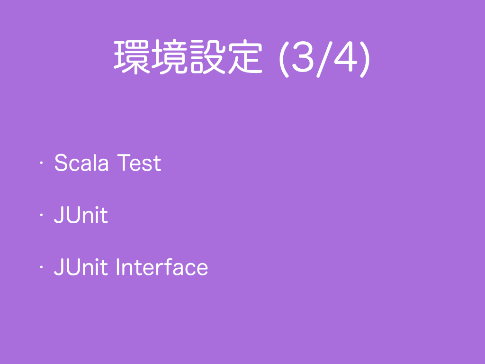
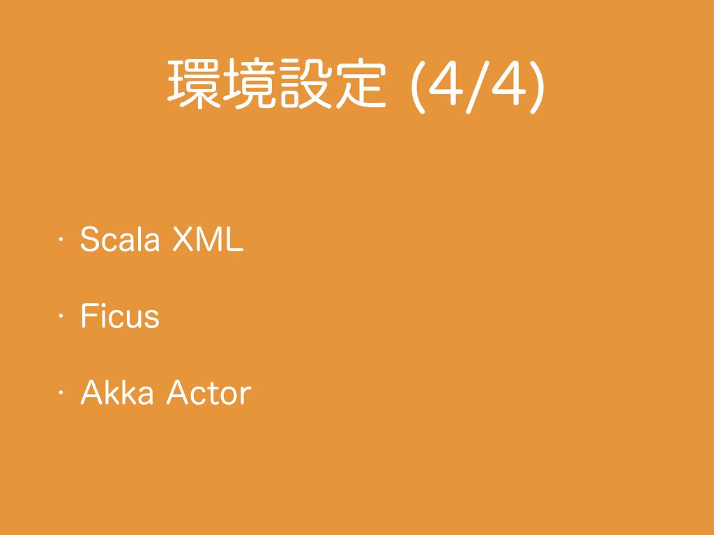

# 2.　環境設定
<h3>2.1　JavaとScala</h3>
  
開発環境としてOracle Java 8とScala 2.11を使用します。Scala Xml 1.0.5も使用します。
Oracle Java 8のJDK (Java Development Kit)とScala 2.11をインストールしてください。
インストーラは下記からダウンロードできます。
<ul>
  <li><a href="http://www.oracle.com/technetwork/java/javase/downloads/index.html" target="_blank">JDK</a></li>
  <li><a href="http://www.scala-lang.org/download/" target="_blank">Scala</a></li>
</ul>
インストールするためのroot権限やsudo権限がない場合は<a href="https://my.vmware.com/ja/web/vmware/downloads" target="_blank">VMWare Player</a>により仮想化した環境にインストールすることができます。
サーバ上に環境構築したいがIDEのGUIも使いたい場合はVNC（<a href="https://www.realvnc.com/" target="_blank">RealVNC</a>など）、<a href="https://help.ubuntu.com/community/FreeNX" target="_blank">FreeNX</a>、<a href="http://www.straightrunning.com/xmingnotes/" target="_blank">Xming</a>などで画面転送する方法があります（Xmingは動作が遅いのでお勧めしません）。
サーバとWindowsのローカルの間でファイル転送したい場合は<a href="https://winscp.net/eng/docs/lang:jp" target="_blank">WinSCP</a>や<a href="https://www.samba.org/" target="_blank">Samba</a>などがあります。Windows上でUnixのコマンド環境を構築したい場合は<a href="https://www.cygwin.com/" target="_blank">Cygwin</a>があります。
本コースでは、開発環境のOSは特に指定はありませんが、いろいろなOSで試したい場合は、マルチブートとVMWare Playerによる仮想化の方法があります。受講者それぞれが置かれている状況に合わせて必要なソフトを使ってScalaの環境を構築してください。<br>
Googleの<a href="https://github.com/google/guava" target="_blank">Guava</a>やApache <a href="https://commons.apache.org/proper/commons-lang/" target="_blank">Commons Lang</a>の<a href="https://commons.apache.org/proper/commons-lang/javadocs/api-release/org/apache/commons/lang3/StringUtils.html" target="_blank">StringUtils</a>には文字列処理に便利なメソッドが存在しますが、本コースでは紹介しません。<br>
<br>
JavaとScalaとScala XMLのAPIについては、<a href="#コラムapi">コラム：API</a>、Scalaの命名規則など書き方のStyleについては<a href="#コラムstyle">コラム：Style</a>を参照ください。
***
<h3>2.3　SBT</h3>
<br>
外部ライブラリの依存関係管理のために<a href="http://www.scala-sbt.org/index.html" target="_blank">SBT 0.13.9</a>を使用します。<a href="http://www.scala-sbt.org/0.13/docs/ja/Setup.html" target="_blank">SBTをインストール</a>してください。<br>
<br>
ちなみに、SBT以外にもライブラリ依存性管理ソフト兼ビルドツールとして<a href="http://gradle.org/" target="_blank">Gradle</a>、<a href="https://maven.apache.org/" target="_blank">Apache Maven</a>があります。依存性管理のみなら<a href="http://ant.apache.org/ivy/" target="_blank">Apache Ivy</a>、ビルドのみなら<a href="http://ant.apache.org/" target="_blank">Apache Ant</a>があります。
***
<h3>2.2　JUnitとScalaTest</h3>

<br>
サンプルコードは出力結果が確認しやすいように基本的にすべてテストコードの形式で提供します。テストコードを書くために外部ライブラリとして<a href="http://junit.org/" target="_blank">JUnit 4.12</a>と<a href="http://www.scalatest.org/" taget="_blank">ScalaTest 2.2.4</a>を使用します。さらに、SBT上でテストするためには、JUnitやScalaTestと同時に<a href="https://github.com/sbt/junit-interface" target="_blank">JUnit interface</a>も必要です（<a href="https://github.com/ynupc/scalastringcourseday1/issues/1">JUnitのテストが実行されない #1</a>）。<br>
<br>
次のサンプルコードの例のようにassertメソッドを使用します。assertメソッドにBoolean型の引数を渡すと、引数が`true`の場合はテストに通り、`false`の場合はテストに通りません。一般的なサンプルコードはソースコードと標準出力結果の対を見せますが、サンプルコードをテストコードで書くことにより標準出力結果を見るよりも明確に結果を確認することができます。特に文字列処理を扱う場合は、見た目が似ている文字があるので標準出力結果を人間が目視で確認するよりテストコードで人間と機械の両者から見て正しいと判別できる方が望ましいです。そのため、サンプルコードにはテストコード形式を採用しました。もし、出力が実際は異なるのではないかと懸念される場合はテストコードを実行するだけで確認が取れるので楽に確かめられます。試しにDay 1のサンプルコード<a href="https://github.com/ynupc/scalastringcourseday1/blob/master/src/test/scala/Day1TestSuite.scala">Day1TestSuite.scala</a>を実行してみてください。
```scala
  @Test
  def test(): Unit = {
    assert(true)
    //assert(false)
  }
```
もし、サンプルコードや解説文等リポジトリ上の情報に修正が必要な場合はリポジトリにissueを立てていただけると助かります。
<br><br>
ちなみに、ユニットテストのためのライブラリとしてはJUnitやScalaTestの他に<a href="https://etorreborre.github.io/specs2/" target="_blank">Specs2</a>、<a href="http://www.scalacheck.org/" target="_blank">ScalaCheck</a>、<a href="http://testng.org/doc/index.html" target="_blank">TestNG</a>などがあります。
<br>
<br>
IDEとIDEのプラグインについては<a href="#コラムide">コラム：IDE</a>、サンプルコードの文字コードについては<a href="#コラムサンプルコードの文字コード">コラム：サンプルコードの文字コード</a>を参照ください。
***
<h3>2.3　Scala XMLとAkka Actor</h3>
<br>
<a href="https://github.com/ynupc/scalastringcourseday3" target="_blank">Day 3</a>と
<a href="https://github.com/ynupc/scalastringcourseday5" target="_blank">Day 5</a>ではScalaでXMLを扱うためのライブラリ<a href="https://github.com/scala/scala-xml" target="_blank">Scala XML</a>を、<a href="https://github.com/ynupc/scalastringcourseday5" target="_blank">Day 5</a>ではマルチスレッドの処理を書くためのライブラリ<a href="http://doc.akka.io/docs/akka/current/scala/actors.html" target="_blank">Akka Actor</a>も使用します。
***
<h3>コラム：API</h3>
Oracle Java 8とScala 2.11とScala Xml 1.0.5のAPIのドキュメントは次です。
<ol>
<li>Java(tm) Platform, Standard Edition 8のAPI仕様<br><a href="http://docs.oracle.com/javase/jp/8/api/" target="_blank">http://docs.oracle.com/javase/jp/8/api/</a>
<li>Scala Standard Library 2.11.7 API<br><a href="http://www.scala-lang.org/api/2.11.7/" target="_blank">http://www.scala-lang.org/api/2.11.7/</a>
<li>Scala module XML API<br><a href="http://www.scala-lang.org/api/2.11.7/scala-xml/" target="_blank">http://www.scala-lang.org/api/2.11.7/scala-xml/</a>
<!--<li><a href="" target="_blank"></a>-->
</ol>
***
<h3>コラム：Style</h3>
言語によって慣習的に使われるコードの書き方の規約のことを、C言語ではCoding standard、JavaではCode Conventions、ScalaではStyleと言います。自分にも他人にも読みやすいプログラムを書くために一読しておくといいと思います。C/C++とJava/Scalaの<a href="https://ja.wikipedia.org/wiki/%E5%91%BD%E5%90%8D%E8%A6%8F%E5%89%87_(%E3%83%97%E3%83%AD%E3%82%B0%E3%83%A9%E3%83%9F%E3%83%B3%E3%82%B0)" target="_blank">命名規則</a>を比べてみると<a href="https://ja.wikipedia.org/wiki/%E3%82%AD%E3%83%A3%E3%83%A1%E3%83%AB%E3%82%B1%E3%83%BC%E3%82%B9" target="_blank">スネークケースなのかキャメルケースなのか</a>といった宗教色の違いが見えてくるはずです。
<ol>
<li>C Coding Standard<br><a href="https://users.ece.cmu.edu/~eno/coding/CCodingStandard.html" target="_blank">https://users.ece.cmu.edu/~eno/coding/CCodingStandard.html</a>
<li>C++ Coding Standard<br><a href="http://www.possibility.com/Cpp/CppCodingStandard.html" target="_blank">http://www.possibility.com/Cpp/CppCodingStandard.html</a>
<li>Code Conventions for the Java Programming Language<br><a href="http://www.oracle.com/technetwork/java/index-135089.html" target="_blank">http://www.oracle.com/technetwork/java/index-135089.html</a></li>
<li>Scala Style Guide<br><a href="http://docs.scala-lang.org/style/" target="_blank">http://docs.scala-lang.org/style/</a>
</ol>
***
<h3>コラム：IDE</h3>
サンプルコードを作成するために、IDEとして<a href="https://www.jetbrains.com/idea/" target="_blank">IntelliJ IDEA</a>とIntelliJ IDEAのプラグインとしてScalaとSBTと.gitignoreのプラグインを使用しています。
***
<h3>コラム：サンプルコードの文字コード</h3>
サンプルコードのファイルの文字コードはUTF-8ですので、システムプロパティの`System.getProperty("file.encoding")`がUTF-8になるように設定する必要があります。JVM始動時に指定する必要があるため`System.setProperty("file.encoding", "UTF-8")`では設定できませんので、JVMオプションで`-Dfile.encoding=UTF-8`を渡すことになります。
SBTを利用する場合は、
build.sbtファイルに```scalacOptions ++= Seq("-encoding", "UTF-8")```や```javacOptions ++= Seq("-encoding", "UTF-8")```を書くことでScalaやJavaのソースコードの文字コードをUTF-8に設定することができます。サンプルコードではbuild.sbtファイルからソースコードの文字コードを設定しています。
SBTの設定ファイル~/.sbtconfigに```SBT_OPTS=-Dfile.encoding=UTF-8```と設定しておくこともできます。

